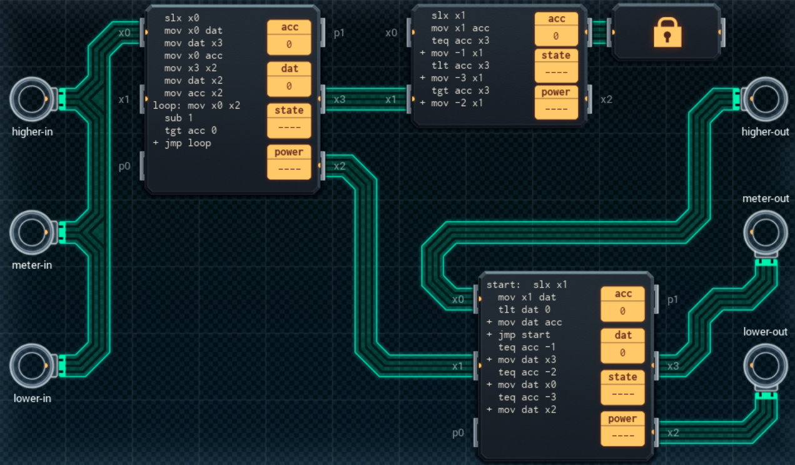

Title: SHENZHEN I/O Smart Grid Control Router
Tags: 
  - SHENZHEN I/O
  - Vinkit
---
`❗ TÄMÄ TEKSTI SISÄLTÄÄ SPOILEREITA ❗`

## SHENZHEN I/O -pelin Smart Grid Control Router -tehtävä
SHENZHEN I/O:n tehtävä numero yhdeksäntoista on Smart Grid Control Router. Alla kuva ensimmäisestä toteutuksesta, jolla sain tehtävän suoritettua.

  

### Missä menin vikaan

Tässä kohtaa peliä tuli ensimmäinen suuri väärinymmärrys tehtävän osalta. Eli en ollut tajunnut missään vaiheessa, että X-väyliä voi yhdistää samaan linjaan ja lukea yhdeltä piiriltä. Tämän takia koetin lukea kaikkia sisääntuloja omilla piireillään, jonka myötä pinta-alaa ei ollut tarpeeksi suunnitelman toteuttamiseksi.

### Mitä olisi voinut tehdä paremmin

Kaikissa kohdin kannattaa käyttää TCP-vertailukomentoa, koska sen avulla säästää aina vähintään yhden komennon verran tilaa. Oikean yläreunan piiri ole tällöin tarpeeton (koska saman koodin saa sisällytettyä vasemman reunan piiriin). Lisäksi porttien ja datan numeroalueet eivät ole testitapauksissa koskaan päällekkäisiä, ja tämän tiedon valossa logiikkaa olisi helppo yksinkertaistaa.

🖥️