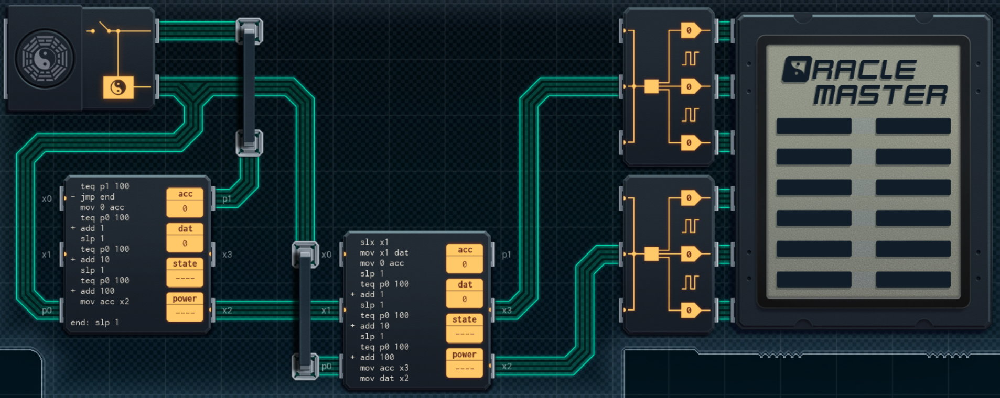

Title: SHENZHEN I/O Pocket I Ching Oracle
Tags: 
  - SHENZHEN I/O
  - Vinkit
---
`❗ TÄMÄ TEKSTI SISÄLTÄÄ SPOILEREITA ❗`

## SHENZHEN I/O -pelin Pocket I Ching Oracle -tehtävä
SHENZHEN I/O:n tehtävä numero kaksikymmentä on Pocket I Ching Oracle. Alla kuva ensimmäisestä toteutuksesta, jolla sain tehtävän suoritettua.

  

### Missä menin vikaan

En missään, tehtävä on helppo ja tehtävänanto on jälleen hyvin ymmärrettävissä. Eli ohjataan näyttöä annettujen syötteiden mukaisesti.

### Mitä olisi voinut tehdä paremmin

Koodin määrää voi vähentää käyttämällä DX300:sta syötteiden lukemiseksi, jolloin DST-komentoa voi käyttää suoraan oikeiden arvojen asettamiseksi, eikä ehtolauseita tarvita. Tämä tosin nostaa myös kustannuksia.

🖥️