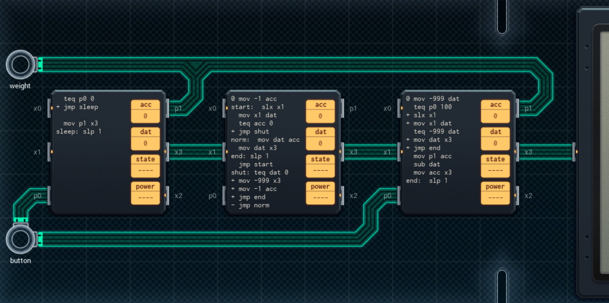

Title: SHENZHEN I/O Precision Food Scale
Tags: 
  - SHENZHEN I/O
  - Vinkit
---
`❗ TÄMÄ TEKSTI SISÄLTÄÄ SPOILEREITA ❗`

## SHENZHEN I/O -pelin Precision Food Scale -tehtävä
SHENZHEN I/O:n tehtävä numero kaksikymmentä yksi on Precision Food Scale. Alla kuva ensimmäisestä toteutuksesta, jolla sain tehtävän suoritettua.

  

### Missä menin vikaan

Oma toteutus päivittää vaa'an lukemaa jatkuvasti, vaikka se ei ole tarpeellista.

### Mitä olisi voinut tehdä paremmin

Ensimmäinen piiri on vaihdettavissa pienempään. Nykyisen painon tallentaminen ns. nolla-arvoksi on omassa toteutuksessa hoidettu liian monimutkaisesti, ja koko logiikka on mahdollista toteuttaa yhdellä suuremmalla piirillä.

🖥️