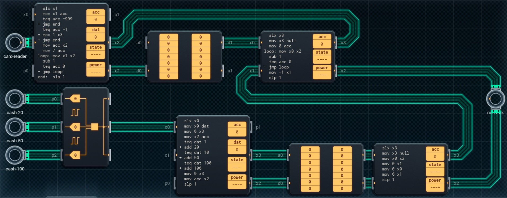

Title: SHENZHEN I/O Cryptocurrency Deposit Terminal
Tags: 
  - SHENZHEN I/O
  - Vinkit
---
`❗ TÄMÄ TEKSTI SISÄLTÄÄ SPOILEREITA ❗`

## SHENZHEN I/O -pelin Cryptocurrency Deposit Terminal -tehtävä
SHENZHEN I/O:n tehtävä numero kaksikymmentä kaksi on Cryptocurrency Deposit Terminal. Alla kuva ensimmäisestä toteutuksesta, jolla sain tehtävän suoritettua.

  

### Missä menin vikaan

En missään, tehtävä on helppo ja tehtävänanto on jälleen hyvin ymmärrettävissä. Eli lasketaan tallennettujen rahojen summa, kirjataan ylös korttinumero ja välitetään ne eteenpäin.

### Mitä olisi voinut tehdä paremmin

Alempaa muistipiiriä ja oikean alalaidan piiriä ei tarvita lainkaan, vaan rahasumman voi tallentaa suoraan P-linjaan (kunhan summan jakaa kymmenellä), ja lukea tarvittaessa toiselta piiriltä (ja kertoo taas kymmenellä).

🖥️