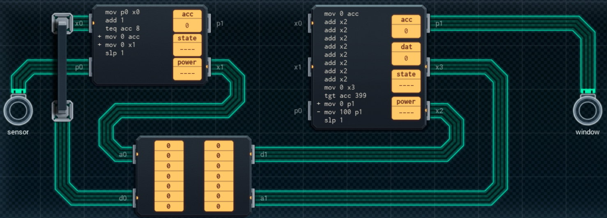

Title: SHENZHEN I/O Pollution-Sensing Smart Window
Tags: 
  - SHENZHEN I/O
  - Vinkit
---
`❗ TÄMÄ TEKSTI SISÄLTÄÄ SPOILEREITA ❗`

## SHENZHEN I/O -pelin Pollution-Sensing Smart Window -tehtävä
SHENZHEN I/O:n tehtävä numero kaksikymmentä kolme on Pollution-Sensing Smart Window. Alla kuva ensimmäisestä toteutuksesta, jolla sain tehtävän suoritettua.

  

### Missä menin vikaan

En missään, tehtävä on helppo ja tehtävänanto on jälleen hyvin ymmärrettävissä. Eli avataan suljetaan ikkuna, jos saasteita on ollut tietyn aikaikkunan sisällä liikaa.

### Mitä olisi voinut tehdä paremmin

Oikean piirin voi vaihtaa pienemmäksi, jos arvot lukee silmukan avulla. Energiankulutuksen kannalta parempi tapa olisi pitää kokoajan kirjaa nykyisestä tilanteesta ja lisätä sitten uusin arvo, ja poistaa vanhin arvo. Tällöin laskettavaa tulee vähemmän. 

🖥️