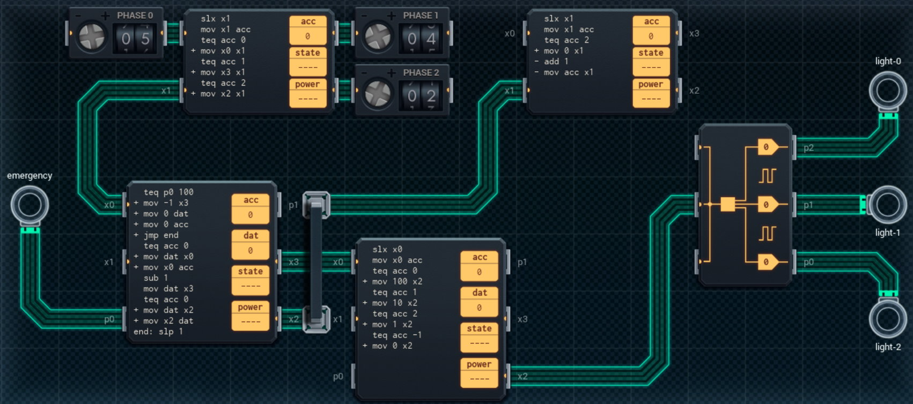

Title: SHENZHEN I/O Traffic Signal
Tags: 
  - SHENZHEN I/O
  - Vinkit
---
`❗ TÄMÄ TEKSTI SISÄLTÄÄ SPOILEREITA ❗`

## SHENZHEN I/O -pelin Traffic Signal -tehtävä
SHENZHEN I/O:n tehtävä numero kaksikymmentä neljä on Traffic Signal. Alla kuva ensimmäisestä toteutuksesta, jolla sain tehtävän suoritettua.

  

### Missä menin vikaan

En missään, tehtävä on helppo ja tehtävänanto on jälleen hyvin ymmärrettävissä. Eli ohjataan liikennevaloja annettujen ohjeiden mukaisesti.

### Mitä olisi voinut tehdä paremmin

Oikean alareunan piirillä voi käskyjä vähentää DST-komennon avulla, jos DX300:n linjat valo-ohjauksiin reitittää toisella tavalla. Vasemman yläreunan piirissä käskyjen määrää voi vähentää TCP-vertailun avulla. Kaikki neljä piiriä on myös mahdollista korvata kahdella suuremmalla piirillä, jos toisella piirillä haetaan sekä valojen kesto kyseisessä vaiheessa että DX300:lle menevä arvo (tällöin sekä oikean yläreunan että oikean alareunan piirit jäävät turhiksi).

🖥️