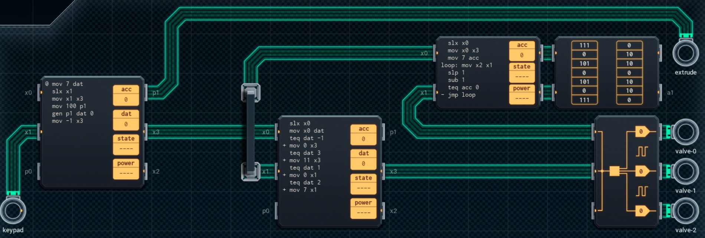

Title: SHENZHEN I/O Meat-Based Printer
Tags: 
  - SHENZHEN I/O
  - Vinkit
---
`❗ TÄMÄ TEKSTI SISÄLTÄÄ SPOILEREITA ❗`

## SHENZHEN I/O -pelin Meat-Based Printer -tehtävä
SHENZHEN I/O:n tehtävä numero kaksikymmentä viisi on Meat-Based Printer. Alla kuva ensimmäisestä toteutuksesta, jolla sain tehtävän suoritettua.

  

### Missä menin vikaan

En missään, tehtävä on helppo ja tehtävänanto on jälleen hyvin ymmärrettävissä. Eli tehdään todella epäherkkullisen näköisiä lihatuotteita annettujen ohjeiden mukaisesti.

### Mitä olisi voinut tehdä paremmin

Molemmat suuremmat piirit voi vaihtaa pienemmiksi, jos muistipiirin lukemiseen käytettävän osoitteen laskee ensimmäisellä piirillä.

🥓🖨️