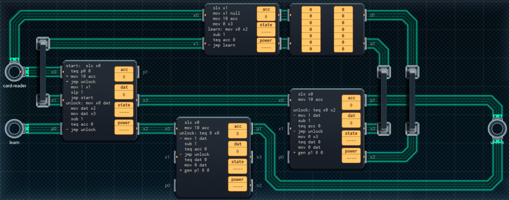

Title: SHENZHEN I/O Electronic Door Lock
Tags: 
  - SHENZHEN I/O
  - Vinkit
---
`❗ TÄMÄ TEKSTI SISÄLTÄÄ SPOILEREITA ❗`

## SHENZHEN I/O -pelin Electronic Door Lock -tehtävä
SHENZHEN I/O:n tehtävä numero kaksikymmentä kuusi on Electronic Door Lock. Alla kuva ensimmäisestä toteutuksesta, jolla sain tehtävän suoritettua.

  

### Missä menin vikaan

En missään, tehtävä on helppo ja tehtävänanto on jälleen hyvin ymmärrettävissä. Eli avataan lukko, jos kortin koodi on opetetun mukainen, tai jos kyseessä on ns. master-avainkortti.

### Mitä olisi voinut tehdä paremmin

Molemmat vertailupiirit vertaavat aina koko sarjan läpi, vaikka vastaan olisi tullut jo "virheellisiä" numeroita, tämä vie paljon energiaa. Varsinaisen avauksen tekemisen voisi myös siirtää omalle piirilleen, jolloin oikean alareunan kaksi piiriä voisi vaihtaa pienemmiksi.

🖥️