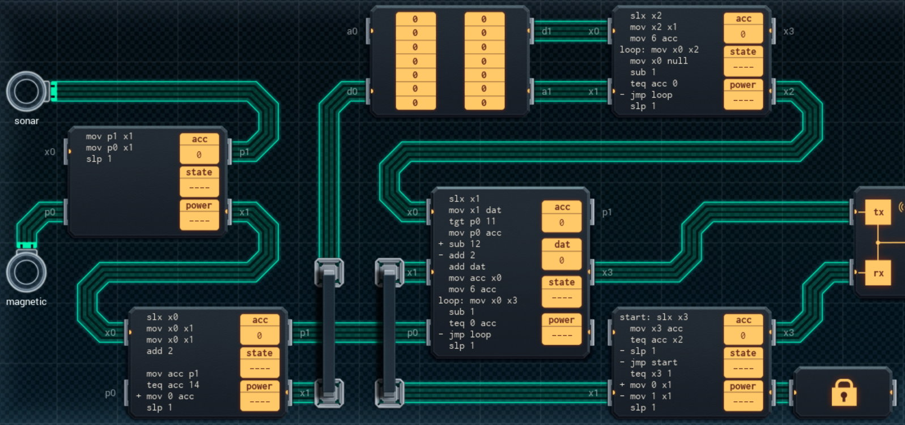

Title: SHENZHEN I/O Deep Sea Sensor Grid
Tags: 
  - SHENZHEN I/O
  - Vinkit
---
`❗ TÄMÄ TEKSTI SISÄLTÄÄ SPOILEREITA ❗`

## SHENZHEN I/O -pelin Deep Sea Sensor Grid -tehtävä
SHENZHEN I/O:n tehtävä numero kaksikymmentä seitsemän on Deep Sea Sensor Grid. Alla kuva ensimmäisestä toteutuksesta, jolla sain tehtävän suoritettua.

  

### Missä menin vikaan

Oletin alkuun, että sonar- ja magnetic-syötteet tulevat eri sykleillä, jonka takia alkuperäinen suunnitelma ei mahtunut lainkaan annettuun tilaan. Ne voi kuitenkin onneksi lukea samalla kellojaksolla ja yhden piirin kautta.

### Mitä olisi voinut tehdä paremmin

Oikean alareunan piirin koodia voi yksinkertaistaa, koska luettua arvoa ei tarvitse tallettaa, sillä arvoa käytetään vain kerran. Muistipiirin kirjoitusosoitetta lasketaan ja välitetään eteenpäin turhan monimutkaisesti, kun sen voisi lukea suoraan muistipiirin a0-väylästä.

🖥️