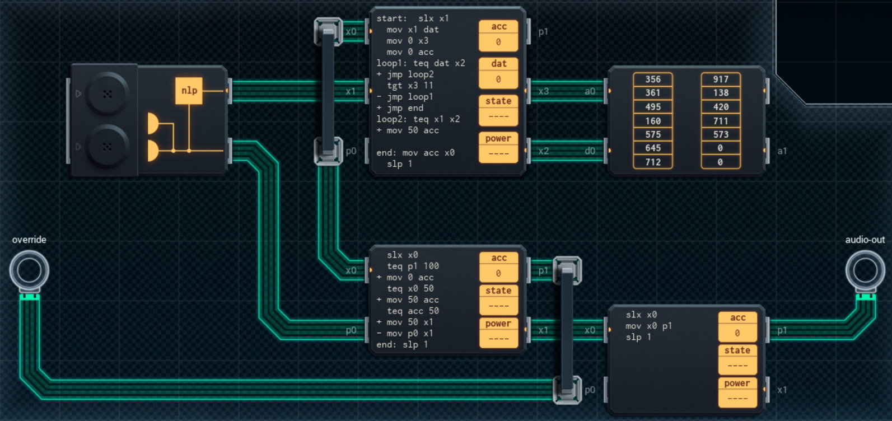

Title: SHENZHEN I/O Spoiler Blocking Headphones
Tags: 
  - SHENZHEN I/O
  - Vinkit
---
`❗ TÄMÄ TEKSTI SISÄLTÄÄ SPOILEREITA ❗`

## SHENZHEN I/O -pelin Spoiler Blocking Headphones -tehtävä
SHENZHEN I/O:n tehtävä numero kaksikymmentä kahdeksan on Spoiler Blocking Headphones. Alla kuva ensimmäisestä toteutuksesta, jolla sain tehtävän suoritettua.

  

### Missä menin vikaan

En missään, tehtävä on helppo ja tehtävänanto on jälleen hyvin ymmärrettävissä. Eli estetään audion läpimeno, jos havaitaan tiettyjä sanoja.

### Mitä olisi voinut tehdä paremmin

Oikean alareunan piiri ei ole tarpeellinen, sillä override-syötteen lukemisen voi muuttaa X-tyyppiseksi DX300:n avulla, jolloin alhaalla keskellä olevan piirin toisen P-linjan voi käyttää ulostulona. Ylimmän piirin SLX-käsky ei myöskään ole tarpeellinen, koska arvoja tulee sisään jatkuvasti.

🖥️