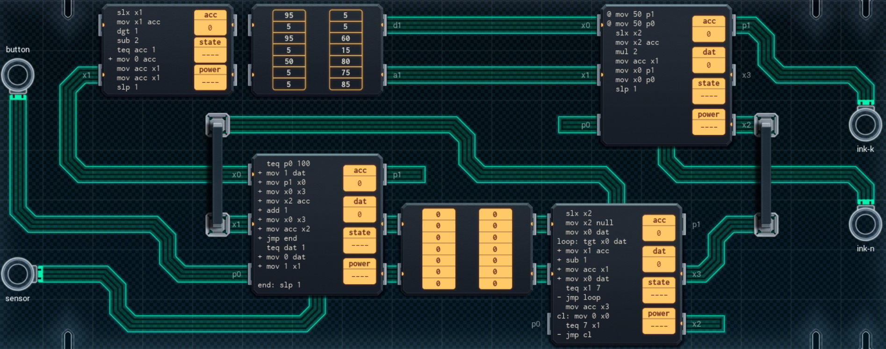

Title: SHENZHEN I/O Color Coordinating Shoes
Tags: 
  - SHENZHEN I/O
  - Vinkit
---
`❗ TÄMÄ TEKSTI SISÄLTÄÄ SPOILEREITA ❗`

## SHENZHEN I/O -pelin Color Coordinating Shoes -tehtävä
SHENZHEN I/O:n tehtävä numero kaksikymmentä yhdeksän on Color Coordinating Shoes. Alla kuva ensimmäisestä toteutuksesta, jolla sain tehtävän suoritettua.

  

### Missä menin vikaan

Ymmärsin luettujen arvojen merkityksen alkuun väärin, tarkoitus ei ole siis laskea niiden keskiarvoa, vaan valita se väri, jota esiintyy eniten.

### Mitä olisi voinut tehdä paremmin

Luettujen arvojen taulukointi ja niiden lukeminen on todella kömpelöä, mutta nähtävästi se oli tämän tehtävän tarkoitus. Punainen väri on minulla taulukoitu kahdesti, joten indeksointia hieman parantamalla energiankulutusta saisi pienennettyä hieman, koska silmukasta saisi yhden kierroksen pois.

🖥️