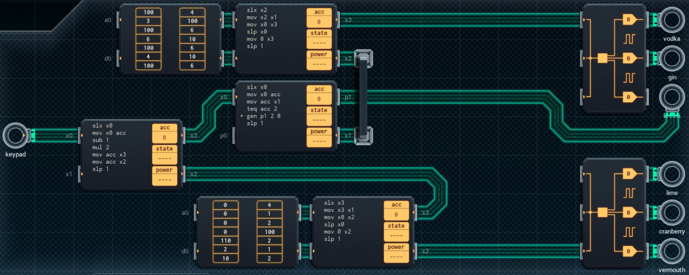

Title: SHENZHEN I/O Airline Cocktail Mixer
Tags: 
  - SHENZHEN I/O
  - Vinkit
---
`❗ TÄMÄ TEKSTI SISÄLTÄÄ SPOILEREITA ❗`

## SHENZHEN I/O -pelin Airline Cocktail Mixer -tehtävä
SHENZHEN I/O:n tehtävä numero kolmekymmentä on Airline Cocktail Mixer. Alla kuva ensimmäisestä toteutuksesta, jolla sain tehtävän suoritettua.

  

### Missä menin vikaan

En missään, tehtävä on helppo ja tehtävänanto on jälleen hyvin ymmärrettävissä. Eli tehdään drinkkejä annettujen ohjeiden mukaisesti.

### Mitä olisi voinut tehdä paremmin

Kaikki pienemmät piirit voi korvata kahdella suuremmalla piirillä, jos toimintoja hieman yhtenäistää. Tällöin tuotantokustannuksia saa pienennettyä.

🍹