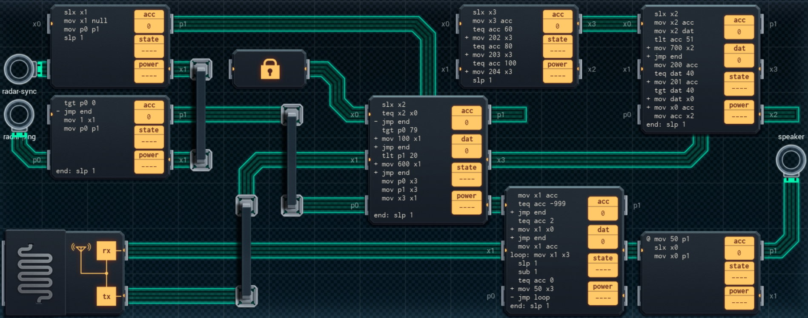

Title: SHENZHEN I/O Safetynet Tracking Badge
Tags: 
  - SHENZHEN I/O
  - Vinkit
---
`❗ TÄMÄ TEKSTI SISÄLTÄÄ SPOILEREITA ❗`

## SHENZHEN I/O -pelin Safetynet Tracking Badge -tehtävä
SHENZHEN I/O:n viimeinen pääkampanjan tehtävä (numero kolmekymmentä yksi) on Safetynet Tracking Badge. Alla kuva ensimmäisestä toteutuksesta, jolla sain tehtävän suoritettua.

  

### Missä menin vikaan

Alkuperäinen idea ei mahtunut annettuun tilaan, koska en ymmärtänyt tallentaa tutkan tietoja P-linjoihin, vaan koetin tallentaa ne muistipiirille. 

### Mitä olisi voinut tehdä paremmin

Oikean alareunan piiri on turha, sillä saman toiminnallisuuden saa sisällytettyä sen viereiselle piirille, kunhan vertailuun käyttää TCP-käskyä, jolloin yksi koodirivi vapautuu sopivaa alustusta varten. Oikean yläreunan pienen ja suuren piirin voi korvata yhdellä ROM-muistilla ja pienemmällä piirillä (DGT-käsky antaa oikean indeksoinnin muistipiirille). Kokonaisuudessa on tällöin kaksi suurempaa piiriä ja kolme pienempää piiriä.

🖥️