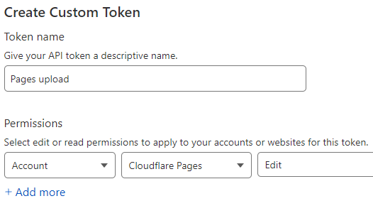

Title: Cloudflare Pages ja GitHub Actions
Tags: 
  - GitHub Action
  - Cloudflare Pages
  - Wrangler
  - staattiset sivut
---

## Cloudflare Pages ja GitHub Actions

**Cloudflare**n [Pages](https://pages.cloudflare.com/)-palvelu mahdollistaa staattisten sivujen luonnin ja jakelun asiakkaille. Pages sisältää myös oman [continuous deployment](https://en.wikipedia.org/wiki/Continuous_deployment) -toiminnallisuuden (CD), mutta siinä olevien erinäisten rajoitusten takia voi jossain tilanteissa olla helpompaa käyttää esim. **GitHub**in CD-toimintoja, ja jättää Pagesin vastuulle vain sisällön jakelu. 

### Wrangler apuun sisällön siirrossa

Tiedostojen siirtäminen Pagesiin CloudFlaren ulkopuolelta tapahtuu yrityksen oman [Wrangler](https://developers.cloudflare.com/workers/wrangler/)-työkalun avulla. Wrangleria asentaessa kannattaa pitää huolta, että ohjelmasta lataa vähintään 2:lla alkavan version, koska Pages-toiminnallisuutta ei ole työkalun 1-alkuisissa versioissa.

#### Wrangler -komento

Valitun Pages-sivuston sisällön korvaaminen uudella tapahtuu seuraavalla komennolla:

```bash
wrangler pages publish KANSIO --project-name=PROJEKTIN_NIMI
```

`KANSIO` korvataan sen kansion nimellä, josta sisältö löytyy (sen sisältämät alikansiot kopioidaan automaattisesti samalla). `PROJEKTIN_NIMI` korvataan halutun CloudFlare Pages -projektin nimellä.

### GitHub Actions

GitHub Actionsin kanssa wrangleria ei kannata asentaa manuaalisesti, vaan käyttää valmista [wrangler-action](https://github.com/cloudflare/wrangler-action):ia. Jotta wrangler-action toimii oikein GitHubissa, tarvitsee GitHub-projektin asetuksiin lisätä kaksi salaisuutta (tässä esimerkissä **CF_API_TOKEN** ja **CF_ACCOUNT_ID**), joiden avulla wrangler osaa kirjautua sisään CloudFlareen.

#### API Tokenin luonti CloudFlaressa

API Tokenin avulla Wrangler pystyy kirjautua sisään CloudFlaren tilille tarvittavilla oikeuksilla. Kyseiselle operaatiolle ei ole valmista API Tokenia palvelussa, vaan se on tehtävä itse.

Aluksi avataan selaimessa CloudFlaren oma [profiilisivu](https://dash.cloudflare.com/profile) (ja tarvittaessa kirjaudutaan sisään palveluun), jonka jälkeen vasemmasta reunasta valitaan **API Tokens**.

  

seuraavaksi painetaan **Create token** -nappia

  

ja valitaan listan pohjalta **Custom token** -osion alta **Get Started**, koska Pagesilla ei ainakaan vielä ole valmista pohjaa tähän operaatioon.

  

Sitten annetaan Tokenille kuvaava nimi (tässä esimerkissä *Pages upload*) ja valitaan **Permissions** -kohtaan valinnat **Account**, **Cloudflare pages** ja **Edit**.

  

ja lopulta siirrytään **Continue to summary** -napilla hyväksyntäsivulle ja kirjataan talteen juuri luodun 

  

Tokenin merkkijono. Kyseistä merkkijonoa ei saa enää tämän jälkeen näkyviin, joten jos se jää kirjaamatta ylös, täytyy vain luoda toinen tokenin.


#### CloudFlare Account ID

CloudFlare Account ID löytyy puolestaan CloudFlaren [DashBoard](https://dash.cloudflare.com/)ilta, josta valitaan kirjautumisen jälkeen haluttu domain ja sen **Overview**-osio. Tämän jälkeen etsitään oikealta **API**-osion alta **Account ID** -merkkjono, jonka voi kopioida talteen **Click to copy** -valinnalla.

  

#### GitHubin Secrets

GitHubissa projektin salaisuuksia ([Secrets](https://docs.github.com/en/actions/security-guides/encrypted-secrets)) pääsee muokkaamaan (olettaen että käyttöoikeudet ovat kunnossa) aukaisemalla projektin sivun GitHubissa, ja painamalla yläpalkista **Settings**-nappia

  

 ja valitsemalla **Secrets and variables** valikosta **Actions**.

   

 uuden salaisuuden saa lisättyä **New repository secret** -napilla

  

Ensimmäinen lisättävä salaisuus on **CF_API_TOKEN** ja sille syötetään aiemmin luotu API token. **CF_ACCOUNT_ID** -salaisuuden sisällöksi tulee puolestaan CloudFlare Account ID -merkkijono. Merkkijonojen sisältöä ei voi tarkistaa enää niiden tallentamisen jälkeen, joten väärän syötteen kohdalla kannattaa vanha arvo poistaa listalta ja luoda salaisuus uudelleen.

  

#### GitHub Actionsin skripti

Kun salaisuudet ovat paikallaan, voi GitHub Actionsiin lisätä seuraavan skriptin, joka lähettää uudet tiedostot wranglerin avulla oikeaan paikkaan

```yaml
- name: Upload to pages
  uses: cloudflare/wrangler-action@2.0.0
  with:
    apiToken: ${{ secrets.CF_API_TOKEN }}
    accountId: ${{ secrets.CF_ACCOUNT_ID }}
    command: pages publish KANSIO --project-name=PROJEKTIN_NIMI
```

`KANSIO` korvataan sen kansion nimellä, josta sisältö löytyy (sen sisältämät alikansiot kopioidaan automaattisesti samalla). `PROJEKTIN_NIMI` korvataan halutun CloudFlare Pages -projektin nimellä.

<span style="font-size:4em;">☁️</span>