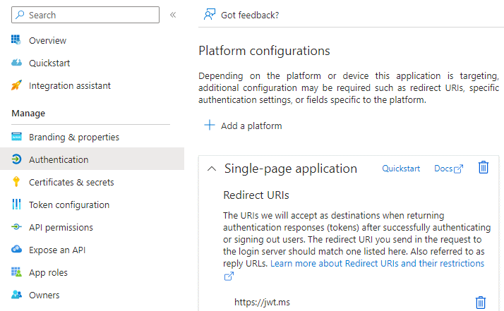
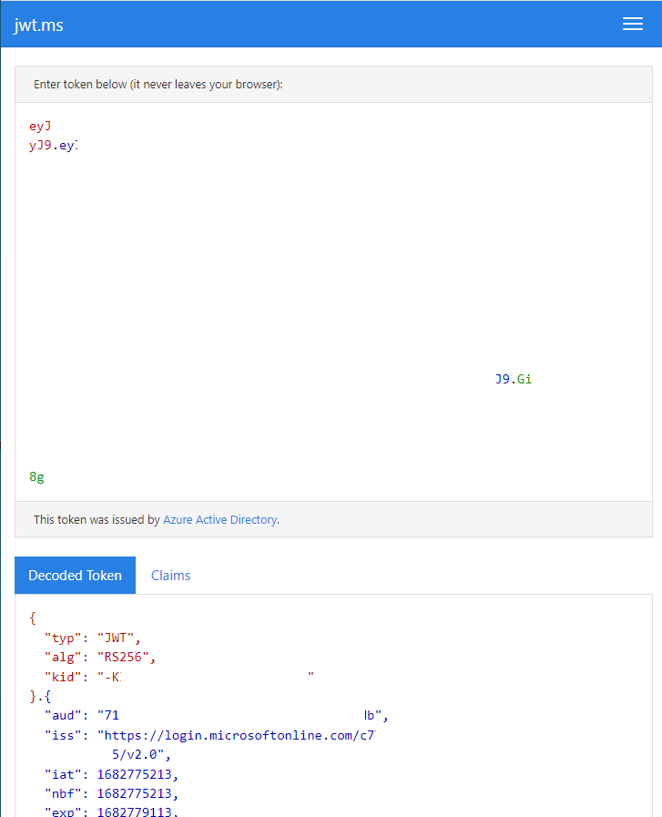

Title: Azuren App registration ja jwt.ms -palvelu
Tags: 
  - Azure AD
  - App registration
  - jwt.ms
  - JWT
  - OAuth
---

## Azuren App registration ja jwt.ms -palvelu

**Microsoft**in **Azure**-pilvipalvelu tarjoaa Azure AD:n kautta mahdollisuuden lisätä omaan verkkopalveluun kohtalaisen helposti [OAuth](https://fi.wikipedia.org/wiki/OAuth) 2.0 -yhteensopivan kirjautumisen. Kun kirjautumiseen käyttää ns. [hybrid flow](https://learn.microsoft.com/en-us/azure/active-directory/develop/v2-oauth2-auth-code-flow#request-an-id-token-as-well-or-hybrid-flow) -tilaa, saa yhdellä pyynnöllä haettua tarvittavan [JWT](https://fi.wikipedia.org/wiki/JSON_Web_Token)-tiedon ja palautettua sen omalle web-sovellukselle.

Välillä tulee kuitenkin esille tarve tarkistella OAuth-yhteensopivan palvelun tarjoaman [JWT](https://fi.wikipedia.org/wiki/JSON_Web_Token)-tiedon sisältöä, ja tämän operaation helpottamiseksi Microsoft on tehnyt selaimessa toimivan [jwt.ms](https://jwt.ms/) -verkkopalvelun. Palvelun suuri positiivinen asia on se, että sen saa yhdistettyä suoraan osaksi Azuren **App registration** -toiminnallisuutta, jolloin JWT:tä ei tarvitse manuaalisesti kopioida mihinkään, vaan tiedot saa heti nähtäville selaimeen.

### App registrationin yhdistäminen

Jos App registrationin kautta tapahtuvan kirjautumisen tietoja haluaa katsella suoraan jwt.ms-palvelun kautta niin operaatio onnistuu helposti lisäämällä App registrationiin uuden Redirect URI:n. Eli aluksi kirjaudutaan Azuren portaaliin, sitten etsitään sieltä **Azure Active Directory** ja sen **App Registrations** -kohdasta etsitään haluttu sovellus. Kun tämän sovelluksen avaa, ja siirtyy sen **Authentication** -kohtaan voi sieltä lisätä uuden Redirect URI:n, jonka osoitteeksi laitetaan `https://jwt.ms`

  

### Toiminnallisuuden testaaminen

Seuraavaksi toimintoa voi testata suoraan omassa selaimessa avaamalla oman tenantin OAuth 2.0 authorize-osoitteen, jonka `redirect_uri`-parametriksi on laitettu `https%3A%2F%2Fjwt.ms` ja jos kaikki meni kohdalleen pitäisi selaimessa näkyä jwt.ms-palvelu JWT-tietojen kera

  
*(Yllä olevaa kuvaa on luonnollisesti sensuroitu)*