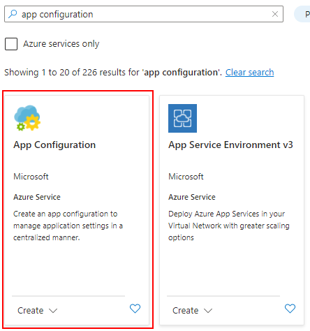
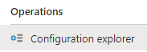
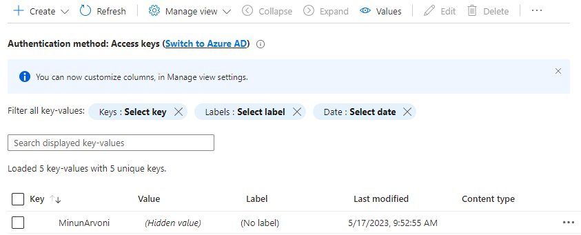
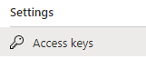
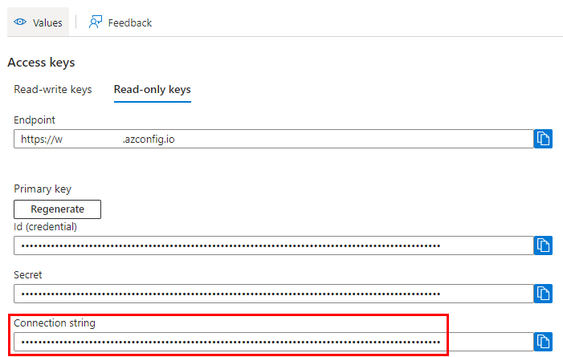
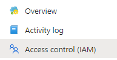
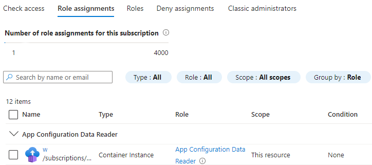

Title: Azuren App Configuration ja kontit
Tags: 
  - Azure
  - App Configuration
  - kontit
---

## Azuren App Configuration ja kontit

Konttien ja konttipalveluiden kanssa pelatessa saattaa tulla tarve hallinnoida tiettyjä asetuksia (esim. tietokantapalvelimen osoite tai yhteyksien määrä) mahdollisimman helposti. Helposti tarkoittaa tässä tapauksessa selaimessa toimivaa työkalua, jossa koko järjestelmän asetuksia saa hallittua keskitetysti ja tarvittaessa luoda erilaisia ympäristöjä esim. testausta ja tuotantoa varten. 

Azuressa tämän toiminnon tarjoaa [App Configuration](https://learn.microsoft.com/en-us/azure/azure-app-configuration/overview), joka on hintatietoiselle henkilölle mukava vaihtoehto, koska siitä on tarjolla [täysin ilmainen](https://azure.microsoft.com/en-us/pricing/details/app-configuration/) taso. Ohjelmointikielten osalta App Configuration on [suoraan tuettu](https://learn.microsoft.com/en-us/azure/azure-app-configuration/overview#use-app-configuration) C#-, Java-, Javascript- ja Python-kielten kanssa lisäämällä sopivan kirjaston mukaan projektiin, ja muiden ohjelmointikielten kanssa on mahdollista käyttää [REST](https://learn.microsoft.com/en-us/rest/api/appconfiguration/)-rajapintaa.

### App Configurationin käyttöönotto

Ensimmäinen vaihe App Configurationin käyttöönottossa on resurssin luonti Azuressa. Tämä tapahtuu esim. Azuren Portalin kautta luomalla uusi App Configuration haluttuun resurssiryhmään. 

  

Luomisen jälkeen kannattaa kopioida talteen luodun App Configurationin osoite (esim. https://XYZ.azconfig.io), sillä sitä tarvitaan myöhemmin. 

Testauksen vuoksi kannattaa palveluun lisätä myös jokin esimerkkiasetus **Configuration Explorer** -osion kautta (vaikkapa `MinunArvoni`), jonka voi myöhemmin noutaa omassa ohjelmassa, ja varmistaa että kaikki toimii oikein.

  

  

#### Salasanakirjautuminen (huono tapa) 📉

Asetusten säätämisen osalta helpoin tapa päästä käsiksi App Configurationiin omasta ohjelmasta on sallia **Access keys** -pohjainen kirjautuminen.



Tässä tavassa **Connection string** riittää sellaisenaan yhteyden luomiseen ohjelman ja App Configurationin välille. **Read-only keys** kelpaa normaalisti hyvin (eli **Read-write keys** -osioon ei tarvitse mennä), koska useimmiten suoritettavan ohjelman ei tarvitse kirjoittaa mitään arvoja App Configuratoriin.



Tämän salasanapohjaisen kirjautumistavan huono puoli on se, että ohjelmassa yhdistämiseen käytettävä connection string pitää säilöä jonnekin, ja se ei saa joutua vääriin käsiin, koska sen avulla kuka tahansa voi lukea App Configuratorissa olevia asetuksia.

#### RBAC ja Azure (hyvä tapa) 📈

Jos omia kontteja ajaa Azuressa (esim. **Azure Container Instances**in kautta) niin tietoturvaa ajatellen kannattaa palvelujen välinen autentikointi ja autorisointi hoitaa Azuren [RBAC](https://learn.microsoft.com/en-us/azure/role-based-access-control/overview):in avulla. [Yksinkertaisesti](https://learn.microsoft.com/en-us/azure/azure-app-configuration/howto-integrate-azure-managed-service-identity) tämä onnistuu laittamalla halutulle resurssille (esim. Azure Container Instancesille) **Identity**-osiosta **System assigned managed identity** -asetus päälle

  

  

Ja tämän jälkeen App Configurationiin lisätään oikeus kyseiselle resurssille menemällä ensin **Access control (IAM)** -osioon

  

ja **Role assignments** -välilehden kautta voidaan äsken lisätylle identiteetille antaa **App Configuration Data Reader** -oikeus.




### App Configuration ja C#

C#:n ja .NET-ympäristön kanssa App Configuration otetaan mukaan projektiin lisäämällä [Microsoft.Extensions.Configuration.AzureAppConfiguration](https://www.nuget.org/packages/Microsoft.Extensions.Configuration.AzureAppConfiguration/) -paketti osaksi projektia. Tämän jälkeen haluttuun .cs-tiedostoon projektissa lisätään seuraavat `using`-lauseet
```cs
using Microsoft.Extensions.Configuration;
using Microsoft.Extensions.Configuration.AzureAppConfiguration;
```

#### Salasanakirjautuminen (huono tapa) 📉

Salasanan sisältävän connection stringin kanssa palveluun yhdistäminen ja halutun asetuksen noutaminen onnistuu seuraavalla tavalla

```cs
var builder = new ConfigurationBuilder();
builder.AddAzureAppConfiguration("Endpoint=https://XYZ.azconfig.io;Id=tunnus;Secret=salasana");

var config = builder.Build();
Console.WriteLine(config["MinunArvoni"]);
```

Tämän tavan huono puoli on se, että yhdistämiseen käytettävä connection string/Endpoint pitää säilöä johonkin, ja yllä esitetty tapa ei ole tietoturvan kannalta hyvä ratkaisu.

#### RBAC ja Azure (hyvä tapa) 📈

Jos RBAC on käytössä, voi yhteyden avauksen ja halutun asetuksen noutamisen tehdä seuraavalla tavalla

```cs
var builder = new ConfigurationBuilder();
builder.AddAzureAppConfiguration(options => options.ConnectWithManagedIdentity("https://XYZ.azconfig.io"));

var config = builder.Build();
Console.WriteLine(config["MinunArvoni"]);
```

ja kaiken pitäisi nyt toimia oikein!

<span style="font-size:4em;">☁️⚡📦</span>