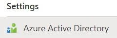
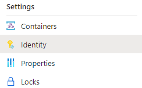
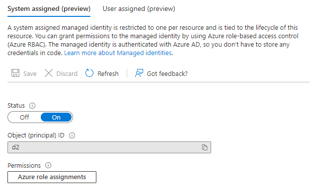

Title: Azure SQL ja salasanaton kirjautuminen
Tags: 
  - Azure SQL
  - Salasanaton
  - Azure AD
  - Microsoft Entra ID
---

## Azure SQL ja salasanaton kirjautuminen

Azure SQL tietokannan kanssa työskennellessä järjestelmän tietoturvaa voi parantaa ottamalla käyttöön salasanattoman kirjautumisen, jolloin tietokannan käyttäjä ei kirjaudu enää sisään käyttäjätunnus + salasana -yhdistelmällä, vaan kirjautumiseen käytetään Azure AD:ta / Entraa ja kirjautuvan sovelluksen hallinnoitua identiteettiä.

### Plussat:

+ Salasanoja ei ole, joten tietoturvan kannata kirjautumistiedot eivät voi valua vääriin käsiin
+ Yhteyden luomiseen käytettävä Connection string -merkkijono voi olla sama kaikilla sovelluksilla
+ Tietokantaoikeudet voi edelleen konfiguroida sovelluskohtaisesti

### Miinukset:

- Säädettävää on hieman enemmän
- Lokaalissa kehityksessä yhteyden avaaminen on työläämpää
- Jokaiseen tietokantaan on luotava erikseen käyttäjät (*user* vs. *login*)

### Vaihe 1: Sallitaan salasanaton kirjautuminen Azure SQL -palvelimeen

Ensimmäisenä sallitaan salasanaton kirjautuminen Azure SQL -palvelimeen. Tämä tapahtuu valitsemalla Azure Portalissa haluttu Azure SQL -palvelin ja menemällä sen **Settings** -osion alla olevaan **Azure Active Directory** -kohtaan. 



Täältä asetetaan haluttu Azure AD / Entra -tili ylläpitäjäksi/admin, jotta muille käyttäjille voidaan myöhemmin lisätä oikeudet tietokantaan tämän ylläpitäjän avulla.

Samassa yhteydessä voidaan pakottaa kirjautuminen pelkällä salasanattomalla tavalla valitsemalla **Support only Microsoft Entra authentication for this server**.

### Vaihe 2: Luodaan sovellukselle identiteetti

Jos halutulla sovelluksella (esim. App Service, Azure Functions jne.) ei ole vielä identiteettiä, luodaan se seuraavaksi.
[Yksinkertaisesti](https://learn.microsoft.com/en-us/azure/azure-app-configuration/howto-integrate-azure-managed-service-identity) tämä onnistuu laittamalla halutulle resurssille (esim. Azure Container Instancesille) **Identity**-osiosta **System assigned managed identity** -asetus päälle ja painamalla **Save**-nappia.

  

  

### Vaihe 3: Lisätään käyttäjä ja oikeudet tietokantaan

Seuraavaksi kirjaudutaan ylläpito-oikeuksilla varustetulla käyttäjällä haluttuun tietokantaan (haluamansa työkalun voi tässä kohtaa valita vapaasti, myös Azure Portalista löytyvä **Query editor** sopii tähän) ja ajetaan seuraavat komennot

```sql
CREATE USER [minun-sovellus] FROM EXTERNAL PROVIDER;
ALTER ROLE db_datareader ADD MEMBER [minun-sovellus];
ALTER ROLE db_datawriter ADD MEMBER [minun-sovellus];
```

jossa `minun-sovellus` korvataan Azure-resurssin nimellä. Tarvittaessa `db_datawriter`-rivin voi jättää kokonaan pois, jos sovelluksen ei tarvitse kirjoittaa mitään tietoa tietokantaan. Oikeudet voi tarvittaessa myös rajoittaa suoraan vain tiettyyn tietokannan tauluun, sillä sovellukselle aiemmin luotu SQL-käyttäjä ei eroa käyttöoikeuksien rajoituksen osalta muista SQL-käyttäjistä.

### Vaihde 4: Otetaan uusi Connection string käyttöön

Seuraavaksi muokataan SQL-yhteyden ottavan sovelluksen asetuksiin/koodiin uusi connection string. 
```
Server=tietokantapalvelin.database.windows.net,1433;Initial Catalog=tietokanta;Encrypt=True;Authentication=Active Directory Default
```
jossa `tietokantapalvelin` ja `tietokanta` korvataan oman Azure SQL -palvelimen nimellä ja tietokannan nimellä.

<span style="font-size:4em;">🗄️🔏</span>
