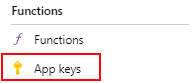

Title: Ajastettujen Azure Functionsien ajaminen pakotetusti
Tags: 
  - Azure Functions
  - Curl
  - Timed trigger
---

## Ajastettujen Azure Functionsien ajaminen pakotetusti

Jossain tilanteissa saattaa tulla tarve käynnistää Azuressa ajastettu (Timer trigger) Azure Functions sen normaalin ajoaikataulun ulkopuolella. Tämä onnistuu helposti komentoriviltä curl-työkalun avulla.

### Vaihe 1: _master -avaimen hankkiminen

Ensimmäiseksi tarvitaan **_master** -avain, jonka avulla Azure varmistaa, että https-kutsun tekijällä on oikeus ajaa haluttu Azure Functions -kutsu. Tämän avaimen saa [Azure portaalista](https://portal.azure.com) menemällä kyseisen Azure Functionsin resurssiin, ja avaamalla sieltä **Functions -> App keys**



ja valitsemalla **_master** -avaimen kohdalla **Copy to clipboard** -napin. Kannattaa huomata, että **_master** -avain on eri jokaisen Azure Functionsin kohdalla.

### Vaihe 2: Luodaan curl-komento

Haluttu curl-komento noudattaa seuraavaa kaavaa

`curl https://XYZ.azurewebsites.net/admin/functions/FunktionNimi -i -X POST -H "Content-Type:application/json" -H "x-functions-key: master-avain" -d "{}"`

jossa siis `XYZ`-kohtaan tulee oman Azure Functionsin osoite, `FunktionNimi` kohtaan tulee halutun ajastetun funktion nimi (esim. **C#**:n kanssa tämä on sama kuin `Function`-attribuutille annettu parametri) ja `master-avain`-kohtaan tulee Vaihe 1 -kohdan avain,

eli esimerkkinä

```bash
curl https://minunfunktiot.azurewebsites.net/admin/functions/Ajastettu -i -X POST -H "Content-Type:application/json" -H "x-functions-key: IeZDZ4qRwRT8AzvhwHjfjxyFfCNbQp9T/jBJAQrXTCIAXqLGDRLnMONrB6fg62hQbmkAIf==" -d "{}"
```

### Vaihe 3: Komennon suoritus

Äsken luodun curl-komennon voi suorittaa suoraan komentoriviltä, sekä Windows-, Linux- että Mac-käyttöjärjestelmillä. Jos kaikki meni oikein, tulee vastaukseksi jotain seuraavanlaista:
```
HTTP/1.1 202 Accepted
Content-Length: 0
Date: Sun, 07 Jan 2024 12:13:14 GMT
Server: Kestrel
Request-Context: appId=...
```

ja komennon suorituksen onnistumista voi seurata esim. Azure Functionsin oman **Logs**-osion avulla.

<span style="font-size:4em;">⚡☁️</span>