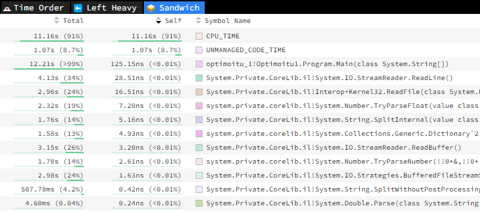

Title: C# ja miljardin rivin haaste, osa 3
Tags: 
  - C#
  - 1brc
---

## C# ja miljardin rivin haaste, osa 3

[Edellisessä blogikirjoituksessa](/posts/CSharp_ja_1brc_osa_2.html) käsittelin ensimmäistä optimoitua versiota. Nyt pureudutaan siihen, että miten siitä löydetään pahimmat pullonkaulat suorituskyvyn osalta.

### Profilointi

.NET-maailmassa ohjelmien profilointiin on tarjolla useita eri työkaluja. Tässä kohdin turvaudun **Microsoft**in luomaan ilmaiseen [dotnet trace](https://www.nuget.org/packages/dotnet-trace)en, koska sitä on helppo käyttää komentoriviltä, ja tulosten analysoinnin voi tehdä suoraan internet-selaimessa.

Omalla kohdalla ajettava komento on siis
```bash
dotnet trace collect --format speedscope -- bin\Release\net8.0\optimoitu_1.exe ..\generointi\measurements.txt
```

Jossa `--format speedscope` pitää huolen siitä, että tulokset tallennetaan [Speedscope](https://www.speedscope.app/)-yhteensopivassa formaatissa.

Profiloinnin kannalta tällainen automaattisesti toimintoja suorittava ohjelma on erinomainen, koska suoritus tapahtuu jokaisella ajolla samalla tavalla, eikä käyttäjän tarvitse itse käyttää ohjelmaa.

Alla kuvankaappaus, jossa näkyvät eniten suoritusaikaa vievät osat Speedscopen **Sandwich**-valinnalla



Kuten kuvasta näkyy, menee koodin suorittamisessa ylivoimaisesti eniten aikaa tiedoston sisällön lukemiseen. Tämän jälkeen listauksessa ovat liukulukujen jäsentäminen, rivin jakaminen kahteen osaan ja Dictionaryn käsittely.

### Tulevat muutokset

Koska tiedoston lukemisen suorituskykyparannukset vaativat eniten muutoksia koodiin, jätän ne myöhempään kertaan. Aloitan siis [pienemmillä muutoksilla](/posts/CSharp_ja_1brc_osa_4.html), joiden pitäisi kuitenkin nopeuttaa ohjelman suoritusta useammalla prosentilla.

<span style="font-size:4em;">📝</span>