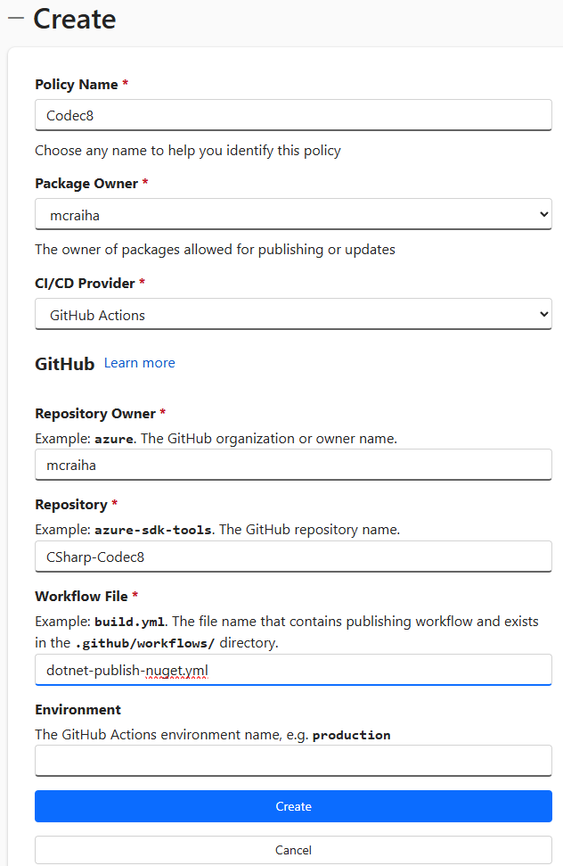

Title: Trusted Publishing ja nuget
Tags: 
  - C#
  - Nuget
  - Github
  - Trusted Publishing
---

## Trusted Publishing ja nuget

Tänään (17.8.2026) astui voimaan nuget-julkaisuun liittyviä [uusia rajoituksia](https://devblogs.microsoft.com/dotnet/strengthening-nuget-supply-chain-security-reducing-api-key-lifetime/#api-key-reduction-plan), joiden myötä nugettien julkaisuun käytettävien API-avaimien elinkaarta rajoitettiin merkittävästi. Jatkossa uudet API-avaimet ovat voimassa vain 30 päivää kerrallaan.

**Microsoft**in tarkoituksena on jatkossa [ajaa kehittäjät käyttämään](https://learn.microsoft.com/en-us/nuget/nuget-org/trusted-publishing) vain tunnin kerrallaan voimassa olevia API-avaimia, jotka noudetaan automaattisesti osana nuget-pakettien julkaisuprosessia. Tällöin varsinaista API-avainta ei siis enää säilötä salaisuutena esim. Githubiin, joka parantaa nuget-pakettien julkaisuun liittyvää tietoturvaa. Microsoft käyttää tästä toiminnallisuudesta nyt nimeä **Trusted Publishing**.

### Github-liitos

Itse otin toiminnallisuuden tänään käyttöön [yhdessä Github-projektissani](https://github.com/mcraiha/CSharp-Codec8), jossa aiemmin julkaisu tapahtui Github-salaisuudella, joka oli voimassa vuoden verran. Käyttöönotto vaatii toimenpiteitä sekä [nuget.org](https://www.nuget.org/)issa että Githubissa.

Ensimmäiseksi nuget.orgissa siirrytään [Trusted Publishing](https://www.nuget.org/account/trustedpublishing) -osioon, jonne lisätään **Create**-kohdan kautta uusi **Policy**. **Policy Name**n voi valita vapaasti. **Package Owner** -kohtaan valitaan oma nuget.org-tunnus ja **CI/CD Provider** -kohtaan valitaan `Github Actions`.

**Repository Owner** -kohtaan kirjoitetaan se Githubin käyttäjä/organisaatio, jonka alla julkaisusta vastaava Github Action pipeline on. **Repository** -kohtaan valitaan Githubista kyseisen käyttäjän/organisaation alta löytyvä repo, jossa Github Action pipelinen .yml-tiedosto löytyy ja **Workflow File** -kohtaan kirjoitetaan kyseisen .yml-tiedoston nimi. **Environment**-kohdan voi jättää tyhjäksi, jos ei hyödynnä Githubin [Environment](https://docs.github.com/en/actions/how-tos/deploy/configure-and-manage-deployments/manage-environments)-toimintoja kyseisessä repositoryssä.

  
(todellisen maailman esimerkki)

Kun Policy on luotu, tehdään seuraavaksi muutama muutos jo olemassa olevaan .yml-tiedostoon. Ensimmäiseksi lisätään permissions-kohta, jos sitä ei vielä ole, ja annetaan id-tokenin kirjoitusoikeus pipelinelle.

```yml
permissions:
  id-token: write  # enable GitHub OIDC token issuance for this job
```

Seuraavaksi haetaan olemassa olevalla Github actionilla token

```yml
- name: NuGet login (OIDC → temp API key)
  uses: NuGet/login@v1
  id: login
  with:
    user: ${{ secrets.NUGET_USER }}
```

(muista tässä kohtaa luoda `NUGET_USER`-nimellä löytyvä salaisuus Github repon asetusten kautta, johon on talletettu nuget.orgin käyttäjätunnus. Samalla kannattaa poistaa mahdollinen aiempi API Key -salaisuus)

Ja lopuksi käytetään haettua vain tunnin voimassa olevaa API-avainta nuget-julkaisuun

```yml
- name: NuGet push
  run: dotnet nuget push paketti.nupkg --api-key ${{steps.login.outputs.NUGET_API_KEY}} --source https://api.nuget.org/v3/index.json
```

Lopputuloksen voi tarkistaa projektin [dotnet-publish-nuget.yml](https://github.com/mcraiha/CSharp-Codec8/blob/main/.github/workflows/dotnet-publish-nuget.yml)-tiedostosta.

<span style="font-size:4em;">🍗</span>